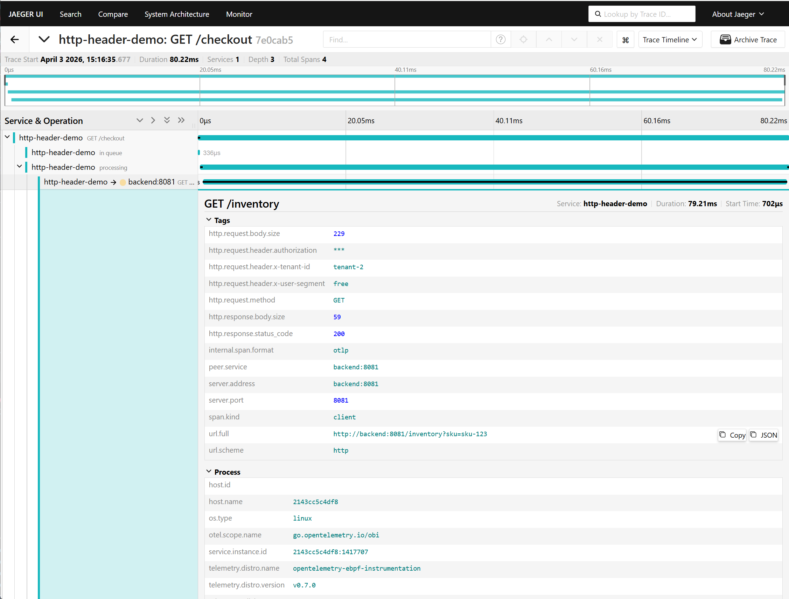
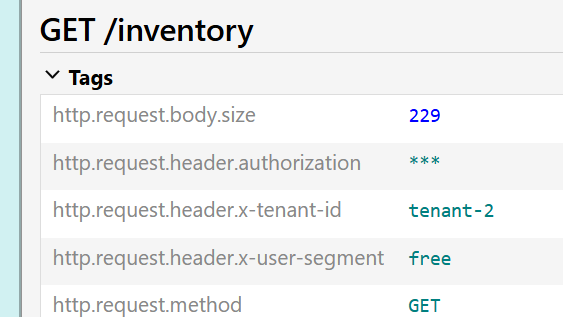
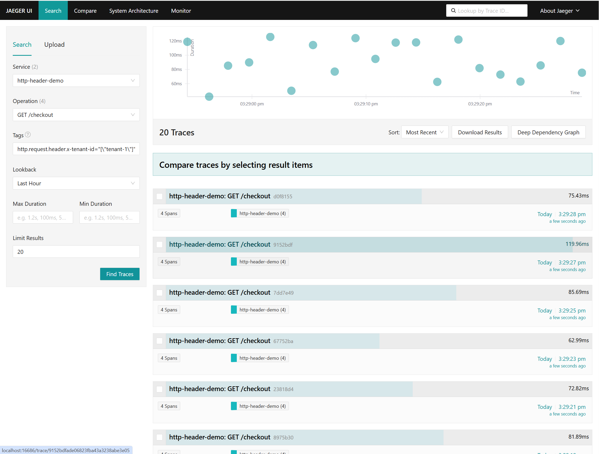

# HTTP Header Enrichment Demo

This example demonstrates OBI's HTTP header enrichment feature introduced in
[v0.7.0](https://github.com/open-telemetry/opentelemetry-ebpf-instrumentation/releases/tag/v0.7.0).

Header enrichment lets you attach HTTP request and response headers as span
attributes — without any code changes to your applications. A policy-driven
ruleset controls which headers are included, excluded, or obfuscated.

## Services

| Service | Description |
|---|---|
| `frontend` | Go HTTP service exposing `GET /checkout` on port 8080 |
| `backend` | Go HTTP service exposing `GET /inventory`, called by frontend |
| `loadgen` | Load generator container that continuously sends requests with demo headers |
| `obi` | OBI, instrumenting traffic automatically via eBPF |
| `jaeger` | Trace UI at `http://localhost:16686` and OTLP receiver |

The load generator service, named `loadgen` in Docker Compose, sends requests
with three headers that the OBI config policy handles:

- `x-tenant-id` — included as a span attribute
- `x-user-segment` — included as a span attribute
- `authorization` — obfuscated (key visible, value masked as `***`)

## Prerequisites

- Docker and Docker Compose
- A Linux host with kernel 5.8+ (or RHEL/CentOS 8 with 4.18 eBPF backports)
- Privileges required to run OBI in `privileged` mode with `pid: host`

## Quick start

```sh
docker compose up --build -d
```

Wait 10–15 seconds for OBI to discover and instrument the services, then open
the [Jaeger UI](http://localhost:16686).

Select service `http-header-demo` and search for recent traces on the
`GET /checkout` operation. Open a trace and expand the span attributes — you
should see the enriched headers:



The `authorization` header is present but masked:



Use the tag filter `http.request.header.x-tenant-id=tenant-1` to isolate
traffic for a specific tenant:



## Compare: without enrichment

To see what traces look like without header enrichment, restart OBI with the
v0.6.0-style config that omits the enrichment policy:

```sh
OBI_CONFIG_FILE=obi-config-v0.6.0.yml docker compose up -d --force-recreate obi
```

Open a trace on the same route. No `http.request.header.*` attributes will
appear:


To switch back to enrichment:

```sh
docker compose up -d --force-recreate obi
```

## Send traffic manually

The `loadgen` container sends continuous traffic automatically. To send a
deterministic burst from your host instead:

```sh
./send-traffic.sh 100
```

## Configuration

The OBI config files are in `configs/`:

| File | Description |
|---|---|
| `obi-config-v0.7.0.yml` | Header enrichment enabled (default) |
| `obi-config-v0.6.0.yml` | No enrichment — baseline comparison |

The active config and OBI image can be overridden with environment variables:

```sh
OBI_IMAGE=otel/ebpf-instrument:v0.7.0 OBI_CONFIG_FILE=obi-config-v0.7.0.yml docker compose up -d --force-recreate obi
```

## Troubleshooting

### No traces appear

Check OBI and Jaeger logs:

```sh
docker compose logs obi
docker compose logs jaeger
```

### OBI fails to start

Confirm the Docker engine allows privileged containers and that
`/sys/kernel/security` exists and is mountable on your host.

**No `http.request.header.*` attributes**

- Confirm `ebpf.track_request_headers: true` is set in the active config.
- The demo apps are Go, so `OTEL_EBPF_SKIP_GO_SPECIFIC_TRACERS=true` must be
  set. This is the default in `docker-compose.yaml`. If you overrode it,
  restore it.
- Send fresh traffic after any config change and OBI restart.
